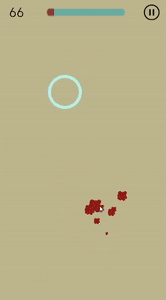

# Geomerty Kill
Тестовое задание на ревью для ютубера [Максима Крюкова](https://www.youtube.com/channel/UCCrLQKMtF_FwOeDgTUuOksw) 

Детали задания:
1. В процессе игры бесконечно генерируются шарики и летят сверху вниз. Задача игрока - успевать лопать эти шарики, чтобы они не успели выйти за пределы экрана.
2. Каждый шарик должен быть создан случайно с определенными настройками (скорость полета; очки за уничтожение; урон, наносимый игроку при выходе за пределы экрана; цвет)
3. Из пользовательского интерфейса должно быть окно вызова меню с рестартом и паузой.
4. Добавить счетчик очков в процессе игры
5. Реализовать логику поражения, если слишком много шариков вышли за пределы экрана. Добавить возможность рестарта. Добавить текущий и лучший результаты.
6. При уничтожении шарика должен производится взрыв частиц того же цвета, что и сам шарик.
7. Добавить логику постоянного ускорения всех шариков с течением времени для усложнения процесса.
8. Версия юнити - 2020

 
 

